### MVCモデルについて
- Model(M)・View(V)・Controller(C)の略
- 複雑になりがちな処理を3つに分ける手法

### 各機能の役割

#### Controllerの役割
***
- ユーザーからの入力に基づき、ModelとViewを制御する

#### Viewの役割
***
- 表示や入出力といった処理をする
****
#### Modelの役割
***
- システムの中でビジネスロジックを担当する